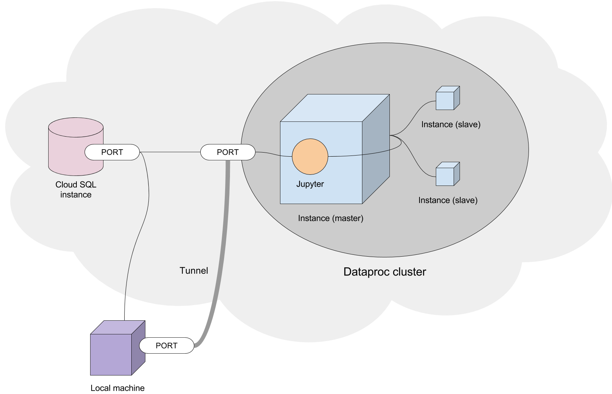
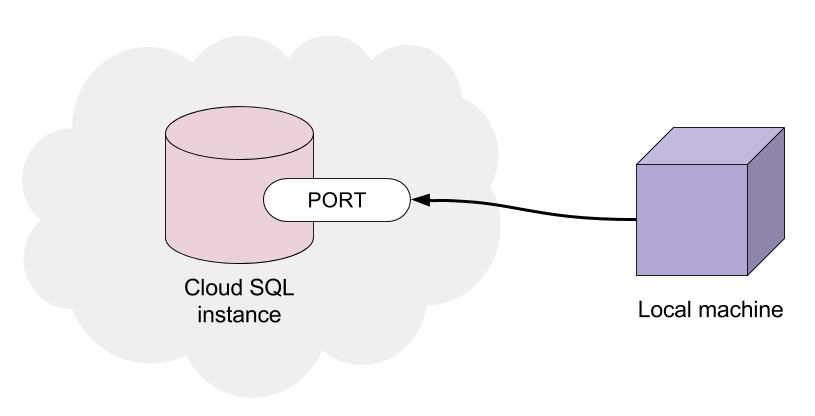
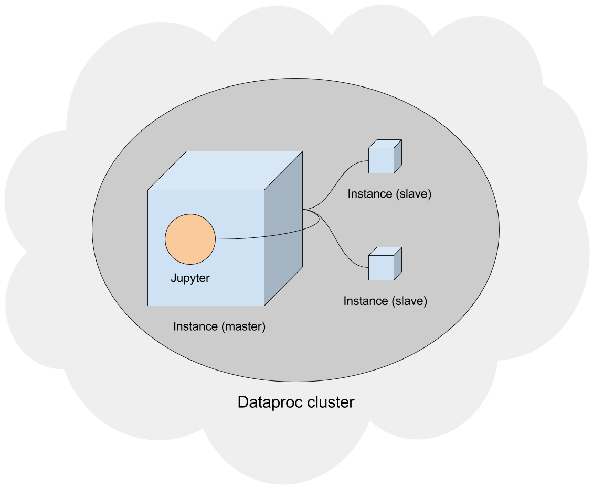
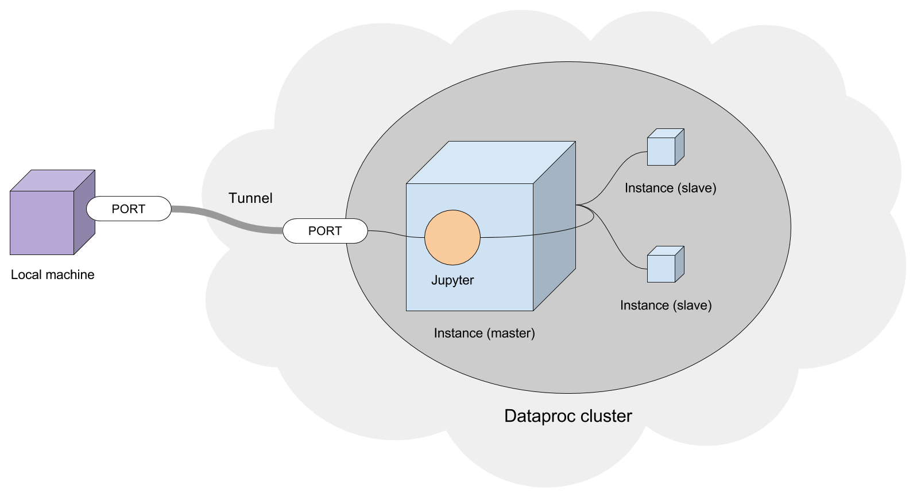

# gcp-jupyter-sql
It can be *very* useful to outsource processing to the cloud as it allows for easy horizontal and vertical scaling. Google Cloud Platform has all the necessary infrastructure to run Jupyter Notebooks in the cloud, from creating a clusterized configuration of notebooks, to reading and writing data to a database.

The following are instructions to run a (Python 3, Anaconda3) Jupyter Notebook using Google Cloud Platform's Dataproc (for clusterized processing) or Compute Engine (for normal processing), as well as Cloud SQL for storing data. A script is provided for uploading CSV data to Cloud SQL, as well as an example of how to query Cloud SQL into a Pandas DataFrame.



The steps are as follows:
- [Setup project](#setup-project)
- [Setup Cloud SQL](#setup-cloud-sql)
  - [(Optional) Upload CSV](#optional-upload-csv)
- [Setup Jupyter Notebook](#setup-jupyter-notebook)
  - [(Optional) Install Anaconda3](#optional-install-anaconda3)
- [Setup SSH tunnel to instance](#setup-ssh-tunnel-to-instance)
- [Connect to Jupyter Notebook](#connect-to-jupyter-notebook)
  - [(Optional) Query Cloud SQL to Pandas DataFrame](#optional-query-cloud-sql-to-pandas-dataframe)

## Setup project
Download and install [Google Cloud SDK](https://cloud.google.com/sdk/). Once installed, the `gcloud` command should be usable from any command prompt with an up-to-date PATH variable.
Run some command prompt, or the included Google Cloud SDK Shell and create a project (if not created one yet):
```
gcloud projects create [PROJECT_ID] --name [PROJECT_NAME]
```
Set this project as the current, working project:
```
gcloud config set project [PROJECT_ID]
```

## Setup Cloud SQL
Run some command prompt, or the included Google Cloud SDK Shell and create a Cloud SQL PostgresQL instance:
```
gcloud sql instances create [INSTANCE_NAME] --database-version POSTGRES_9_6
```
Check and take note of the newly created instance's IP:
```
gcloud sql instances list
```
Add some user (where `HOST` refers to the instance's IP):
```
gcloud sql users create [USER_NAME] [HOST] --instance [INSTANCE_NAME] --password [PASSWORD]
```
Go to the [Cloud SQL instance's page](https://console.cloud.google.com/sql/instances), select your instance, and go to **Databases** > **Create database** and create one.

In order to be able to connect to the instance locally, it is necessary to whitelist the local IP. Go to [Google](http://www.google.com) and search for "IP". This will return your local, external IP. Go to **Authorization** > **Add network** and enter this IP.

Finally, the newly created user will have limited privileges. In order to give it all privileges on all tables, you need to go to **Overview** > **Connect to this instance** > **Connect using Cloud Shell**. The Cloud Shell will open with a default connection command available. Press enter to get access to the PSQL client.

Once inside, switch to the database you want:

```
\c [DATABASE_NAME]
```

Then grant privileges to the desired user on all tables:

```sql
GRANT ALL PRIVILEGES ON ALL TABLES IN SCHEMA public TO [USER_NAME];
```

### (Optional) Upload CSV
The easiest way to upload a CSV is to use Python. Connect to the Cloud SQL instance using SQLAlchemy, load the CSV using Pandas, and insert it to some table.



Import both Pandas and SQLAlchemy:
```python
import pandas as pd
from sqlalchemy import create_engine
```

Connect to the Cloud SQL instance using SQLAlchemy:
```python
settings = {
   'user': '[USER_NAME]',
   'pass': '[PASSWORD]',
   'host': '[HOST]',
     'db': '[DATABASE_NAME]'
}
url = 'postgresql+psycopg2://{user}:{pass}@{host}:5432/{db}'.format(**settings)  # 5432 is the default port
engine = create_engine(url, client_encoding='utf8')
```

Load the CSV using Pandas:
```python
df = pd.read_csv('[CSV_FILE_NAME].csv')  # this returns a DataFrame
```

NOTE: Make sure that the column names are valid (no spaces, no illegal characters, etc.). A useful trick is to map columns that satisfy a known, problematic condition. For example, replace the `%` sign with the string `percent`:

```python
old_columns = list(df.columns)
new_columns = [_.replace('%', 'percent') for _ in old_columns]
df = df.rename(columns=dict(zip(old_columns, new_columns)))
```

If the CSV has an empty initial column for its index, make sure to drop it because it will get renamed to `Unnamed: 0` which contains a space:

```python
df = df.drop('Unnamed: 0', axis=1)
```

Finally, insert DataFrame to some table:
```python
df.to_sql('[TABLE_NAME]', con=engine, if_exists='replace')
```

See [`example/upload-csv.py`](example/upload-csv.py)

## Setup Jupyter Notebook
### Using Dataproc (clusterized processing)



Run some command prompt, or the included Google Cloud SDK Shell and create a Dataproc cluster (2 workers) with Jupyter base image:
```
gcloud dataproc clusters create [CLUSTER_NAME] --master-machine-type n1-standard-2 --worker-machine-type n1-standard-2 --initialization-actions gs://dataproc-initialization-actions/jupyter/jupyter.sh
```
Check the newly created instances:
```
gcloud dataproc clusters list
```
You will see a master instance (`[CLUSTER_NAME]-m`) and 2 workers (`[CLUSTER_NAME]-w-0` and `[CLUSTER_NAME]-w-1`). Take note of the master instance's IP.

### Using Compute Engine (normal processing)


Run some command prompt, or the included Google Cloud SDK Shell and create a Debian 9 Compute Engine instance:
```
gcloud compute instances create [INSTANCE_NAME] --image-family debian-9 --image-project debian-cloud
```

Check the newly created instance:
```
gcloud compute instances list
```
Take note of the instance's IP.

Go to the [Compute Engine instance's page](https://console.cloud.google.com/compute/instances), select your instance, scroll down to the **Firewalls** section and tick both **Allow HTTP traffic** and **Allow HTTPS traffic**.

Go to the **Remote access** section and click on **SSH**. Once the console loads up, install Jupyter:
```
pip install jupyter
```

NOTE: If you plan on using Anaconda3, this step is not necessary since Anaconda3 comes with Jupyter.

### (Optional) Install Anaconda3
Run some command prompt, or the included Google Cloud SDK Shell and connect to the instance using SSH. If you used Dataproc, the `[INSTANCE_NAME]` will refer to the master instance (`[CLUSTER_NAME]-m`):
```
gcloud compute ssh --zone [ZONE] [INSTANCE_NAME]
```
Once authenticated, proceed downloading Anaconda3:
```
sudo apt-get install bzip2
sudo wget https://repo.continuum.io/archive/Anaconda3-5.0.0.1-Linux-x86_64.sh
```

NOTE: You can always visit the [Anaconda archive](https://repo.continuum.io/archive/) to get any version's URL.

Proceed to install Anaconda3:
```
bash Anaconda3-5.0.0.1-Linux-x86_64.sh
```

It will ask if you want to add Anaconda3 to the PATH variable. Say `yes` to this step.

Check if installation is successful by running `ls` and checking that the `anaconda3/` folder is present at position.

Check if `conda` registered to path by running `conda`. If not recognized, add to path manually using `source ~/.bashrc`.

## Setup SSH tunnel to instance



Go to the [External IP Addresses list page](https://console.cloud.google.com/networking/addresses/list) and make the instance's IP static. If you used Dataproc, the instance's IP you want to make public is the master instance (`[CLUSTER_NAME]-m`). Take note of this IP.

Run some command prompt, or the included Google Cloud SDK Shell and connect to the instance using SSH. If you used Dataproc, the `[INSTANCE_NAME]` will refer to the master instance (`[CLUSTER_NAME]-m`):
```
gcloud compute ssh --zone [ZONE] [INSTANCE_NAME]
```
Once authenticated, proceed to running the Jupyter Notebook and exposing port 8888:
```
jupyter notebook --ip=0.0.0.0 --port=8888 --no-browser
```
Once the server is running, it will generate an output similar to the following:
```
[I NotebookApp] The Jupyter Notebook is running at: http://0.0.0.0:8888/?token=6650c754c8cddf2dd8cee7923a116ad021dfec8fe085c99a
```
Take note of the value for the token parameter (e.g. `6650c754c8cddf2dd8cee7923a116ad021dfec8fe085c99a`)

Thus far, you have Jupyter running on a Google Cloud instance, on port 8888. Now we need to tunnel this port to another port, we will use local port 2222 to interface with remote port 8888.

Run a new command prompt, or the included Google Cloud SDK Shell and connect to the instance again using SSH. This time, passing a flag to create the tunnel:
```
gcloud compute ssh --zone [ZONE] --ssh-flag="-L" --ssh-flag="2222:localhost:8888" [INSTANCE_NAME]
```

## Connect to Jupyter Notebook
Now that there is an open connection that tunnels local port 2222 to remote port 8888, where there is a Jupyter notebook running, you can simply open some browser (e.g. Google Chrome) and visit `localhost:2222`.

Once inside, it will ask for the token. Provide the token that was shown in the output when running the server, and that's it.

### (Optional) Query Cloud SQL to Pandas DataFrame
**If you want to query your Cloud SQL database, you need to whitelist the IP from which the query originates from**. We had previously whitelisted our local IP, but now we need to whitelist our Jupyter instance IP so that Jupyter can query Cloud SQL.

To do this, simply go to the [Cloud SQL instance's page](https://console.cloud.google.com/sql/instances), select your instance, and go to **Authorization** > **Add network** and enter the instance's IP.

Once the instance has permission, inside the Jupyter notebook, import both Pandas and SQLAlchemy:
```python
import pandas as pd
from sqlalchemy import create_engine
```

Install `psycopg2` within Jupyter (code that starts with a `!` in Jupyter executes bash commands). This is necessary to query SQL from Pandas:
```
!pip install psycopg2
```

Connect to the Cloud SQL instance using SQLAlchemy:
```python
settings = {
   'user': '[USER_NAME]',
   'pass': '[PASSWORD]',
   'host': '[HOST]',
     'db': '[DATABASE_NAME]'
}
url = 'postgresql+psycopg2://{user}:{pass}@{host}:5432/{db}'.format(**settings)  # 5432 is the default port
engine = create_engine(url, client_encoding='utf8')
```

Create some query string, for example:
```python
query = """
    SELECT *
    FROM [TABLE_NAME]
"""
```

Perform query and store results in DataFrame:
```python
df = pd.read_sql(query, con=engine)
```

See [`example/query-sql-pandas.py`](example/query-sql-pandas.py)
